# n8n Drug Preparation and Docking

This repository contains an importable n8n workflow for ligand preparation, automatic receptor selection, rigid-receptor docking with AutoDock Vina, scientific HTML reports, Google Drive delivery, and a structural handoff for later molecular dynamics work.

The workflow accepts a SMILES string from Google Drive. It can use a supplied PDB entry or build a receptor hypothesis from ChEMBL activity records and experimental RCSB structures. Every selection decision is retained in the report.

This is a research workflow. Docking scores and predicted poses do not establish binding, efficacy, safety, or a clinically useful interaction.

## Repository contents

| Path | Contents |
| --- | --- |
| `workflow/drug-prep-docking.workflow.json` | Complete n8n workflow, inactive and stripped of credentials |
| `scripts/python/` | Importable copies of every Python Code node |
| `scripts/javascript/` | Importable copies of every JavaScript Code node |
| `scripts/manifest.json` | Node-to-file mapping and source SHA-256 values |
| `examples/` | Plain SMILES, automatic-selection, and supplied-receptor inputs |
| `docs/OUTPUTS.md` | Report and MD handoff file reference |
| `docs/SCIENTIFIC_METHOD.md` | Selection, preparation, docking, and interpretation details |
| `tools/extract_code_nodes.py` | Deterministic Code-node extractor and consistency checker |
| `tests/` | Repository, workflow, script, and publication-safety checks |

## Workflow

```mermaid
flowchart LR
    A[Google Drive trigger] --> B[Download input]
    B --> C[Parse text or JSON]
    C --> D[Normalize and validate]
    D --> E[Select or accept receptor]
    E --> F[Generate ligand 3D structure]
    F --> G[Descriptors and Rule of Five]
    G --> H[Meeko ligand PDBQT]
    H --> I[PDBFixer and Meeko receptor preparation]
    I --> J[AutoDock Vina replicas]
    J --> K[Parse poses and scores]
    K --> L[Distance-contact screen]
    L --> M[Build structural MD handoff]
    M --> N[Build HTML and machine-readable reports]
    N --> O[Create Drive report and MD folders]
    O --> P[Upload reports and handoff files]
    P --> Q[Final run summary]
    Q --> R[Remove temporary run workspace]
```



The imported workflow also contains sticky notes describing accepted inputs, processing stages, report files, and the MD handoff.

## Processing stages

1. Validate the Drive file extension and input fields.
2. Canonicalize the SMILES and create a deterministic RDKit conformer.
3. Calculate basic ligand descriptors and Rule-of-Five violations.
4. Prepare the ligand with Meeko and retain atom mapping information.
5. Select a receptor automatically or accept the supplied PDB entry.
6. Download the RCSB mmCIF structure, map the requested chain, repair the receptor with PDBFixer, and prepare receptor PDBQT with Meeko.
7. Use a supplied box center or infer the center from the most similar eligible co-crystallized component.
8. Run one to three AutoDock Vina replicas with recorded seeds.
9. Parse ranked poses, Vina scores, RMSD bounds, and replica consistency.
10. Run a transparent distance-based receptor contact screen.
11. Produce linked HTML reports, JSON records, overlay files, and the structural MD handoff.
12. Upload the results to Google Drive and remove the temporary run directory.

## Requirements

The workflow targets self-hosted n8n because the Code nodes require scientific Python packages, the `vina` executable, and a shared writable filesystem.

The tested scientific stack was:

- AutoDock Vina 1.2.7
- Meeko 0.7.1
- RDKit 2026.03.5
- OpenMM 8.6
- PDBFixer from conda-forge
- GNU `sha256sum`

The n8n deployment needs:

- native Python Code-node execution through a configured task runner;
- the packages listed in `environment.yml` installed in that runner;
- `vina`, `mk_prepare_receptor.py`, and `sha256sum` available on `PATH`;
- outbound HTTPS access to ChEMBL, RCSB, and the 3Dmol.js CDN;
- a shared, writable `/md_project/data` directory;
- a Google Drive OAuth2 credential with permission to read the input folder and write to the reports folder.

Use n8n's current [task runner setup guide](https://docs.n8n.io/deploy/host-n8n/configure-n8n/set-up-task-runners) and [task runner environment-variable reference](https://docs.n8n.io/deploy/host-n8n/configure-n8n/basic-configuration/use-environment-variables/task-runners). Keep the n8n and runner image versions matched.

The runner import policy must allow these third-party modules:

```text
rdkit, meeko, openmm, pdbfixer
```

The Code nodes also use these Python standard-library modules:

```text
base64, json, math, os, re, shutil, subprocess, sys, tempfile,
time, urllib, urllib.parse, urllib.request
```

## Import and configure

1. Clone the repository.

   ```bash
   git clone https://github.com/usama-zameer84/n8n-drug-prep-docking.git
   cd n8n-drug-prep-docking
   ```

2. Import `workflow/drug-prep-docking.workflow.json` from the n8n workflow editor.

3. Create two Google Drive folders:

   - one folder for input files;
   - one parent folder for completed report folders.

4. Open `SMILES Drop (Drive Trigger)` and replace `YOUR_GOOGLE_DRIVE_INPUT_FOLDER_ID`.

5. Open `Create Run Folder (Drive)` and replace `YOUR_GOOGLE_DRIVE_REPORTS_PARENT_FOLDER_ID`.

6. Select the same Google Drive OAuth2 credential on every Google Drive node.

7. Confirm that the n8n service and Python runner share `/md_project/data`.

8. Run the repository checks, activate the workflow, and place an example file in the input folder.

The public workflow contains no credential IDs, access tokens, personal Drive folder IDs, or active trigger state.

## Input formats

Accepted extensions are `.txt`, `.smi`, `.smiles`, and `.json`.

A plain-text file uses the first non-empty, non-comment line. The first whitespace-separated token is treated as SMILES:

```text
Cn1c(=O)c2c(ncn2C)n(C)c1=O caffeine
```

Plain-text input uses automatic receptor selection and default docking settings.

JSON is the production format. Only `smiles` is required:

```json
{
  "smiles": "Cn1c(=O)c2c(ncn2C)n(C)c1=O",
  "ligand_name": "caffeine",
  "receptor_selection_mode": "auto",
  "target_organism": "Homo sapiens",
  "target_similarity_threshold": 70,
  "target_candidate_limit": 5,
  "size_x": 20,
  "size_y": 20,
  "size_z": 20,
  "ph": 7.4,
  "exhaustiveness": 8,
  "num_modes": 9,
  "energy_range": 3,
  "seed": 20260824,
  "cpu": 1,
  "replicas": 1,
  "timeout_seconds": 900,
  "cutoff": 4.5
}
```

Automatic mode is selected when `pdb_id` is omitted or set to `AUTO`. A supplied receptor uses this form:

```json
{
  "smiles": "Cn1c(=O)c2c(ncn2C)n(C)c1=O",
  "ligand_name": "caffeine",
  "receptor_selection_mode": "provided",
  "pdb_id": "9H37",
  "chain_ids": ["A"]
}
```

An explicit box requires all three center fields:

```json
{
  "center_x": -21.484,
  "center_y": 5.774,
  "center_z": 17.871,
  "size_x": 20,
  "size_y": 20,
  "size_z": 20
}
```

Important validation limits:

| Field | Accepted range or values | Default |
| --- | --- | --- |
| `target_similarity_threshold` | 40 to 100 | 70 |
| `target_candidate_limit` | 1 to 10 | 5 |
| `heterogen_policy` | `remove_all`, `keep_water` | `remove_all` |
| `ph` | 4 to 10 | 7.4 |
| `size_x`, `size_y`, `size_z` | 8 to 30 A; total volume at most 27000 A3 | 20 A |
| `exhaustiveness` | 8 to 64 | 8 |
| `num_modes` | 1 to 20 | 9 |
| `energy_range` | 1 to 10 kcal/mol | 3 |
| `cpu` | 1 to 8 | 1 |
| `replicas` | 1 to 3 | 1 |
| `timeout_seconds` | 60 to 1800 | 900 |
| `cutoff` | 2.5 to 6 A | 4.5 A |

Multi-component SMILES are rejected unless `allow_multicomponent` is explicitly set to `true`. Stereochemistry, protonation, tautomer state, salts, and covalent chemistry still require review.

## Automatic receptor selection

Automatic mode follows a recorded and reproducible ranking process:

1. Canonicalize the query ligand with RDKit.
2. Retrieve up to 12 ChEMBL molecules above the configured similarity threshold.
3. Collect organism-matched binding and functional activity records without a data-validity warning.
4. Keep `SINGLE PROTEIN` targets with a UniProt accession.
5. Rank target evidence from similarity, record count, distinct similar molecules, maximum pChEMBL, and exact-query evidence.
6. Search RCSB for experimental structures containing non-polymer components.
7. Combine target evidence with structure resolution and ligand availability.
8. Map author chains from the RCSB UniProt/SIFTS annotations.
9. Try the best structures in order and select the first one that passes a real PDBFixer-to-Meeko preparation preflight.

`03a_receptor_selection.html` records the ranked targets, selected target and structure, rejected preflight candidates, score components, source URLs, rationale, and limitations.

Target fishing produces a receptor hypothesis. It does not prove that the query ligand binds the selected protein.

## Binding-site and docking box selection

The workflow uses the box center in this order:

1. user-supplied `center_x`, `center_y`, and `center_z`;
2. centroid of the eligible co-crystallized component with the highest RDKit fingerprint similarity to the query ligand;
3. prepared-receptor centroid as a flagged smoke-test fallback.

The selected source and coordinates appear in the docking report and provenance files. Review the box in a molecular viewer before using a pose for further work.

## Reports

Each run creates a Google Drive folder containing linked reports and machine-readable artifacts:

| File | Purpose |
| --- | --- |
| `index.html` | Run outcome, identity, top Vina score, QC flags, and scope |
| `01_input_provenance.html` | Drive source, hashes, input profile, SMILES, receptor source |
| `02_ligand_preparation.html` | Conformer method, Meeko preparation, descriptors, 2D structure |
| `03_receptor_preparation.html` | Chains, heterogens, repairs, missing atoms, binding-site reference |
| `03a_receptor_selection.html` | Automatic selection findings, candidate ranking, rationale, preflight |
| `04_docking_results.html` | Vina settings, box, ranked poses, replica consistency |
| `05_distance_contacts.html` | Residue-level geometric contacts and method limitations |
| `06_methods_qc.html` | Software versions, reproducibility parameters, QC flags |
| `07_md_handoff_readiness.html` | Structural handoff status and work required before MD |
| `08_raw_data.html` | Complete machine-readable report data |
| `09_visualization.html` | Interactive receptor view and receptor-matched pose overlay |
| `run_summary.json` | Compact status, receptor, score, Drive metadata, artifact list |
| `ligand_overlay.json` | Overlay group, receptor profile, ligand metadata, colors, scores |
| `all_best_poses.sdf` | Best poses collected for the exact receptor profile |
| `receptor_overlay_reference.pdb` | Receptor coordinates used by the overlay |

Overlay groups require the same PDB source hash, selected chains, heterogen policy, and pH. Later runs against that exact profile are added to later report snapshots. The viewer loads 3Dmol.js over HTTPS.

See [docs/OUTPUTS.md](docs/OUTPUTS.md) for the complete file reference.

## MD handoff

The `MD_Handoff` subfolder preserves receptor and ligand structures, the best complex, atom mapping, docking results, logs, provenance, checksums, and a manifest.

Its status is `STRUCTURAL_HANDOFF_ONLY_NOT_TOPOLOGY_READY`. It does not contain force-field parameters, a system topology, solvent, ions, equilibration, a trajectory, or MD analysis. Those steps depend on the selected force fields and the chemistry under study.

## Extracted scripts

The Code-node implementations remain embedded in the workflow because n8n requires them there. `tools/extract_code_nodes.py` also exports each implementation as a normal source file:

```bash
python3 tools/extract_code_nodes.py
python3 tools/extract_code_nodes.py --check
```

Python exports expose `run(_items)`. JavaScript exports expose `run()` and expect n8n globals at execution time. `scripts/manifest.json` records the original node name, node ID, language, file path, and SHA-256 of the embedded source.

## Checks

Run the same checks used by GitHub Actions:

```bash
python3 -m unittest discover -s tests -v
```

The suite checks the workflow structure, credential removal, placeholder folder IDs, Code-node extraction, Python and JavaScript syntax, expected report artifacts, and repository publication hygiene.

## Scientific scope

The workflow completes ligand preparation, receptor preparation, rigid-receptor docking, pose export, a geometric contact screen, reporting, and structural file packaging.

It does not perform induced-fit docking, ensemble docking by default, alchemical free-energy calculations, molecular dynamics, experimental validation, toxicity prediction, or clinical interpretation. Vina scores are model scores for pose ranking. They are not measured binding free energies.

Review the method and limitations in [docs/SCIENTIFIC_METHOD.md](docs/SCIENTIFIC_METHOD.md) before using results in a study.

## Primary software and data services

- [AutoDock Vina documentation](https://autodock-vina.readthedocs.io/en/latest/)
- [Meeko documentation](https://meeko.readthedocs.io/)
- [RCSB PDB Search API](https://search.rcsb.org/)
- [RCSB Data API](https://data.rcsb.org/)
- [ChEMBL Data Web Services](https://chembl.gitbook.io/chembl-interface-documentation/web-services/chembl-data-web-services)
- [RDKit documentation](https://www.rdkit.org/docs/)
- [PDBFixer repository](https://github.com/openmm/pdbfixer)
- [OpenMM documentation](https://docs.openmm.org/)

## License

The repository is released under the MIT License. AutoDock Vina, Meeko, RDKit, OpenMM, PDBFixer, n8n, 3Dmol.js, ChEMBL, and RCSB data and software remain subject to their own terms and citation requirements.
