# n8n workflow

This directory contains the importable n8n workflow, its exported Code-node sources, and
example inputs. A Google Drive trigger starts one ligand-preparation and docking run, then the
workflow uploads the reports and structural MD handoff to a configured Drive folder.

Docking scores rank predicted poses. They do not prove binding or measure experimental
affinity. The MD handoff is structural and still needs force-field parameters, topology,
solvation, equilibration, and validation.

## Directory contents

| Path | Contents |
| --- | --- |
| `workflow/drug-prep-docking.workflow.json` | Inactive workflow with placeholder Drive folders and no credentials |
| `scripts/python/` | Python Code-node implementations exported from the workflow |
| `scripts/javascript/` | JavaScript Code-node implementations exported from the workflow |
| `scripts/manifest.json` | Node names, IDs, source paths, and SHA-256 values |
| `examples/` | Plain SMILES, automatic-selection JSON, and supplied-receptor JSON examples |
| `tools/extract_code_nodes.py` | Export and consistency checker for embedded Code-node source |

## Processing flow

```mermaid
flowchart LR
    A[Drive trigger] --> B[Download input]
    B --> C[Validate parameters]
    C --> D[Select or accept receptor]
    D --> E[Prepare ligand and receptor]
    E --> F[Run Vina replicas]
    F --> G[Parse poses and contacts]
    G --> H[Build reports and MD handoff]
    H --> I[Upload to Drive]
    I --> J[Clean temporary run files]
```



## Requirements

Use self-hosted n8n with a Python task runner. The n8n service and task runner must share a
writable `/md_project/data` directory.

The task runner needs:

- Python packages from [`../environment.yml`](../environment.yml)
- `vina` at `/usr/local/bin/vina`
- GNU `sha256sum` on `PATH`
- outbound HTTPS access to ChEMBL, RCSB, UniProt, and the 3Dmol.js CDN
- permission to read and write `/md_project/data`

Create the shared environment from the repository root:

```bash
conda env create -f environment.yml -n drugprep
conda activate drugprep

python -c "import rdkit, openmm, pdbfixer, meeko, gemmi, vina; print('scientific stack OK')"
which vina sha256sum
```

The workflow currently calls `/usr/local/bin/vina`. If the conda executable is elsewhere,
create a link once on the task-runner host:

```bash
sudo ln -s "$(conda run -n drugprep which vina)" /usr/local/bin/vina
```

Allow these third-party Python imports in the n8n runner policy:

```text
rdkit, meeko, openmm, pdbfixer
```

Follow the n8n documentation for native Python task runners and keep the n8n and runner image
versions aligned.

## Import and configure

1. Import `n8n/workflow/drug-prep-docking.workflow.json` in the n8n workflow editor.
2. Create one Google Drive folder for input files.
3. Create a second Drive folder that will contain completed run folders.
4. Open `SMILES Drop (Drive Trigger)` and replace
   `YOUR_GOOGLE_DRIVE_INPUT_FOLDER_ID`.
5. Open `Create Run Folder (Drive)` and replace
   `YOUR_GOOGLE_DRIVE_REPORTS_PARENT_FOLDER_ID`.
6. Select the same Google Drive OAuth2 credential on every Drive node.
7. Confirm that the n8n service and Python runner both see `/md_project/data`.
8. Run the repository tests, activate the workflow, and upload an input file.

The checked-in workflow is inactive. It contains no credential IDs, access tokens, or personal
Drive folder IDs.

## Input files

The trigger accepts `.txt`, `.smi`, `.smiles`, and `.json` files. Each file describes one
ligand.

### Plain SMILES

For text input, the workflow uses the first non-empty line that does not begin with `#`. The
first whitespace-separated value is the SMILES. Remaining text becomes the ligand name.

```text
Cn1c(=O)c2c(ncn2C)n(C)c1=O caffeine
```

Plain input uses automatic receptor selection and all default settings.

### Automatic receptor selection JSON

Only `smiles` is required. This example includes the main search and docking controls:

```json
{
  "smiles": "Cn1c(=O)c2c(ncn2C)n(C)c1=O",
  "ligand_name": "caffeine",
  "receptor_selection_mode": "auto",
  "target_organism": "Homo sapiens",
  "target_similarity_threshold": 70,
  "target_candidate_limit": 5,
  "size_x": 20,
  "size_y": 20,
  "size_z": 20,
  "ph": 7.4,
  "exhaustiveness": 8,
  "num_modes": 9,
  "energy_range": 3,
  "seed": 20260824,
  "cpu": 1,
  "replicas": 1,
  "timeout_seconds": 900,
  "cutoff": 4.5
}
```

### Supplied receptor JSON

Set `receptor_selection_mode` to `provided`, supply a four-character PDB ID, and optionally
list the chains to retain:

```json
{
  "smiles": "Cn1c(=O)c2c(ncn2C)n(C)c1=O",
  "ligand_name": "caffeine",
  "receptor_selection_mode": "provided",
  "pdb_id": "9H37",
  "chain_ids": ["A"],
  "size_x": 20,
  "size_y": 20,
  "size_z": 20,
  "replicas": 1,
  "seed": 20260826
}
```

The complete examples are in [`examples/`](examples/).

## Input field reference

| Field | Default | Accepted value | Meaning |
| --- | --- | --- | --- |
| `smiles` | required | non-empty SMILES, at most 1000 characters | Ligand structure |
| `ligand_name` | `ligand` | text; normalized for filenames | Run and folder label |
| `receptor_selection_mode` | inferred | `auto` or `provided` | Receptor source mode |
| `pdb_id` | empty | four-character PDB ID | Required for supplied mode |
| `chain_ids` | mapped chains | JSON list or comma-separated string | Chains retained during preparation |
| `target_organism` | `Homo sapiens` | non-empty name under 100 characters | ChEMBL evidence filter |
| `target_similarity_threshold` | `70` | 40 to 100 | Minimum ligand similarity percentage |
| `target_candidate_limit` | `5` | integer from 1 to 10 | Number of target candidates retained |
| `heterogen_policy` | `remove_all` | `remove_all` or `keep_water` | Receptor heterogen handling |
| `add_missing_residues` | `false` | boolean | Build missing receptor residues |
| `allow_multicomponent` | `false` | boolean | Permit dot-separated components in the SMILES |
| `center_x`, `center_y`, `center_z` | inferred | all three numbers from -10000 to 10000 Å | Docking-box center |
| `size_x`, `size_y`, `size_z` | `20` | 8 to 30 Šeach; volume at most 27000 ų | Docking-box size |
| `ph` | `7.4` | 4 to 10 | Hydrogen-addition pH |
| `exhaustiveness` | `8` | integer from 8 to 64 | Vina search effort |
| `num_modes` | `9` | integer from 1 to 20 | Poses requested per replica |
| `energy_range` | `3` | 1 to 10 kcal/mol | Vina score window |
| `seed` | `20260824` | integer from 1 to 2147483647 | Base random seed |
| `cpu` | `1` | integer from 1 to 8 | Vina CPU threads |
| `replicas` | `1` | integer from 1 to 3 | Repeated docking runs for this ligand |
| `timeout_seconds` | `900` | integer from 60 to 1800 | Timeout for each replica |
| `cutoff` | `4.5` | 2.5 to 6 Å | Heavy-atom contact cutoff |

Supply either all three box-center coordinates or none. Automatic box placement first tries
the most similar eligible co-crystallized ligand, then falls back to the receptor centroid with
a QC flag.

## Receptor selection

Automatic mode canonicalizes the ligand with RDKit, retrieves similar ChEMBL molecules,
collects organism-matched activity evidence, keeps single-protein targets with UniProt
accessions, and ranks experimental RCSB structures. It maps author chains with UniProt/SIFTS
annotations and selects the first candidate that passes a PDBFixer-to-Meeko preparation
preflight.

`03a_receptor_selection.html` records the ranked targets, candidate structures, chain mapping,
preflight failures, selected receptor, evidence sources, and limitations. The selected target
is a testable hypothesis, not proof that the ligand binds that receptor.

## Output delivery

For each successful input, n8n creates one run folder inside the configured Drive reports
folder. It uploads the report files to that folder and the structural files to its
`MD_Handoff` subfolder.

### Report files

| File | Contents |
| --- | --- |
| `index.html` | Run identity, best score, selected replica, QC flags, and scope warning |
| `01_input_provenance.html` | Drive source, ligand identity, receptor source, URLs, and checksums |
| `02_ligand_preparation.html` | 3D conformer method, descriptors, Rule-of-Five result, and ligand depiction |
| `03_receptor_preparation.html` | Chain selection, repair, heterogens, pH, preparation counts, and box reference |
| `03a_receptor_selection.html` | Target evidence, candidate structures, preflight results, and selection rationale |
| `04_docking_results.html` | Vina settings, box, replica seeds, ranked poses, scores, and consistency statistics |
| `05_distance_contacts.html` | Receptor residues within the configured heavy-atom cutoff |
| `06_methods_qc.html` | Software versions, reproducibility settings, QC flags, and review requirements |
| `07_md_handoff_readiness.html` | Structural checks and work still required before MD |
| `08_raw_data.html` | Full machine-readable run object displayed as JSON |
| `09_visualization.html` | Receptor and pose viewer with score and overlay controls |
| `run_summary.json` | Compact status, score, selection, QC, handoff, and Drive-delivery summary |
| `ligand_overlay.json` | Receptor profile and pose metadata used by the viewer |
| `all_best_poses.sdf` | Best-pose SDF records for the matching receptor profile |
| `receptor_overlay_reference.pdb` | Prepared receptor used as the overlay reference |

The n8n visualization embeds the structure text but loads 3Dmol.js from its CDN, so the page
needs internet access when opened.

### `MD_Handoff` files

The subfolder contains:

- receptor source, prepared PDB, receptor PDBQT, preparation metadata, and preparation log
- ligand input SDF, ligand PDBQT, 2D SVG, docked PDBQT, and exported docked poses
- `best_pose_ligand.sdf`, `best_pose_ligand.pdb`, and `complex_best_pose.pdb`
- Vina logs, parsed docking results, distance contacts, and Meeko export log
- atom mapping, provenance, handoff notes, and a SHA-256 `manifest.json`

`best_pose_ligand.sdf` is the chemistry-authoritative ligand file because it retains bond order
better than PDB. See [`../docs/OUTPUTS.md`](../docs/OUTPUTS.md) for every filename and
[`../docs/SCIENTIFIC_METHOD.md`](../docs/SCIENTIFIC_METHOD.md) for interpretation limits.

## Keep exported sources synchronized

The workflow JSON must retain the Code-node source because n8n executes it there. The files in
`scripts/` make the same source reviewable and testable.

After editing a Code node in the workflow JSON, export and verify the source files:

```bash
python3 n8n/tools/extract_code_nodes.py
python3 n8n/tools/extract_code_nodes.py --check
```

Python exports provide `run(_items)`. JavaScript exports provide `run()` and expect the n8n
runtime globals.

## Checks

From the repository root:

```bash
python3 -m unittest discover -s tests -v
python3 n8n/tools/extract_code_nodes.py --check
```

The checks verify workflow structure, placeholder Drive configuration, absence of credentials,
exported-source consistency, script syntax, report artifacts, and publication hygiene.
